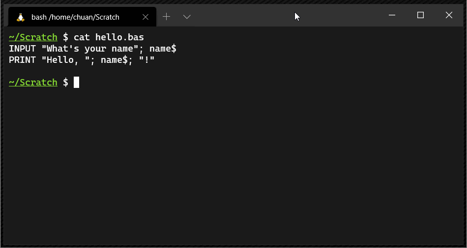
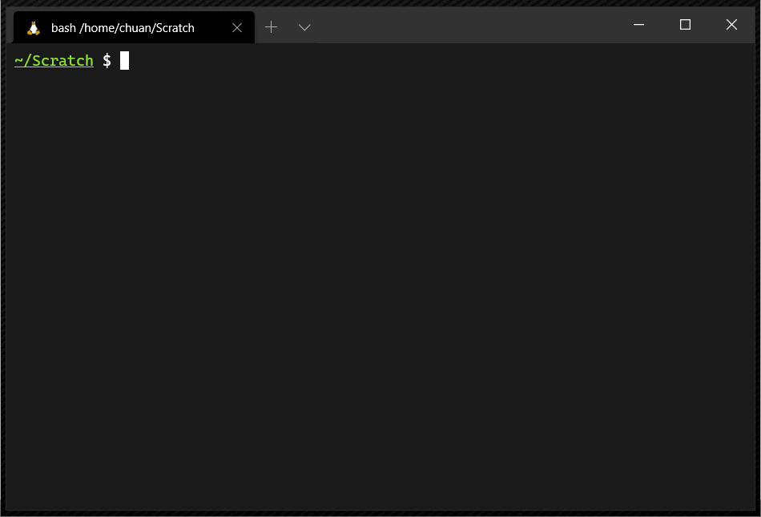

# qbjc

**qbjc** is a QBasic to JavaScript compiler. It compiles a QBasic program into a JavaScript module
that can run directly as a standalone program:



## Usage

```bash
# Install from NPM
npm install -g qbjc
# Compile hello.bas and write output to hello.bas.js
qbjc hello.bas
# ...or run hello.bas directly:
qbjc --run hello.bas
```

Command line options:

```
Usage: qbjc [options] <file.bas>

Options:
  -V, --version        output the version number
  -o, --output <file>  output file path
  -r, --run            run the compiled program after compilation
  --minify             minify the compiled program
  --source-map         enable source map generation
  --no-bundle          disable bundling with runtime code
  --debug-ast          enable generation of AST file for debugging compilation
  --debug-trace        enable stack trace for debugging compilation
  -h, --help           display help for command
```

## Compatibility

What works:

- Core language features
  - Control flow structures - loops, conditionals, goto, gosub etc.
  - Data types - primitive types, arrays and user-defined types (a.k.a. records)
  - Program structure - `SUB`s and `FUNCTION`s
  - `DATA` constants
- Text mode
  - Basic text I/O - `PRINT`, `INPUT`, `INKEY$`, `INPUT$` etc.
  - Text mode screen manipulation - `COLOR`, `LOCATE` etc.
  - Note that the current implementation requires a VT100-compatible terminal emulator. On Windows,
    this means using WSL or something like PuTTY.

See [examples](./examples) and [test programs](./src/tests/testdata/compile-and-run) for an idea of
what is currently implemented.

What doesn't work (yet):

- Running in the browser
- Graphics and audio
- Error handling control flow - `ON ERROR` etc.
- OS APIs like file I/O
- Direct memory access (`DEF SEG`, `PEEK` and `POKE`)
- Less common syntax, inputs or options for statements and built-in functions
- ...and a lot more - contributions are welcome!

It's just enough to run the original `NIBBLES.BAS` game that shipped with QBasic ([examples/nibbles.bas](./examples/nibbles.bas)):



## About

qbjc is distributed under the Apache License v2.
